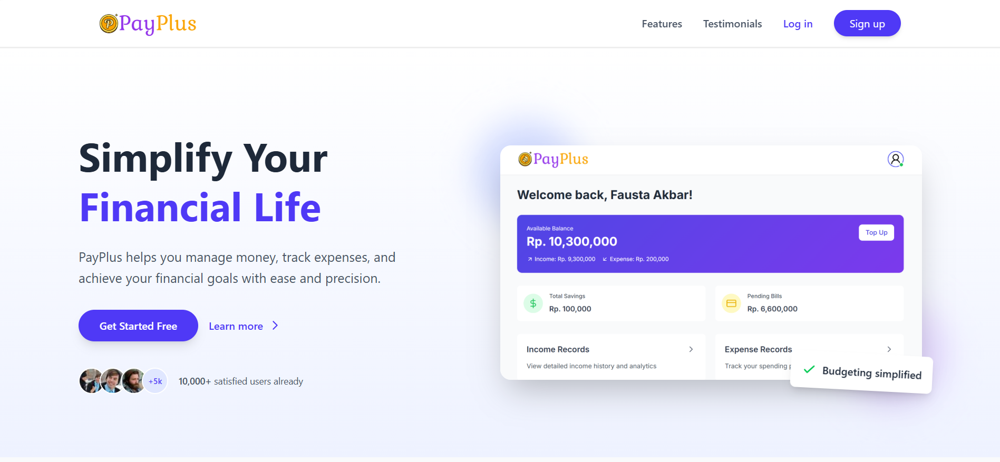

# 💸 PayPlus

PayPlus is a full-stack personal finance management platform designed to help users manage savings, transactions, expenses, income, bills, and more—accessible via web and mobile applications.

---

## 📁 Project Structure

PayPlus/
│
├── payplus_backend/ # Node.js + Express backend API
├── PayPlus_FE/ # Frontend (React + Vite)
├── PayPlus_Mobile/ # Mobile application (Flutter)
└── README.md # Main project readme

---

## 🚀 Features

- 💰 Track income, expenses, and savings
- 📈 View transaction history
- 👨‍👩‍👧‍👦 Manage friends and bill splitting
- 🧠 Integrated Chatbot for assistance
- 📱 Cross-platform: Web and Mobile App
- 🔐 Authentication (Signup/Login)
- 🧾 Bill management & Top-up system

---

## 🛠️ Tech Stack

### Backend (Node.js + Express)
- MySQL
- RESTful API
- JWT-based authentication

### Frontend (React + Vite)
- React Router
- TailwindCSS / CSS Modules
- Axios for API calls

### Mobile (Flutter)
- Dart + Flutter framework
- Android-native configurations
- Shared functionality with backend

---

## 📦 Getting Started

### Clone the Repository
git clone https://github.com/FaustaAkbar/PayPlus.git
cd PayPlus

### 🔙 Backend Setup (payplus_backend)
cd payplus_backend
npm install
# Setup MongoDB URI and other configs in .env
node db_init.js    # initialize the database
node index.js      # start the server

### 🌐 Frontend Setup (PayPlus_FE)
cd PayPlus_FE
npm install
npm run dev        # start development server at http://localhost:5173

### 📱 Mobile App Setup (PayPlus_Mobile)
cd PayPlus_Mobile
flutter pub get
flutter run        # run on connected device or emulator

---

## 📸 Screenshots

---

## 📂 Modules Overview
Authentication: Login, Signup
Dashboard: Summary of financials
Transactions: Income, Expense, Transfer
Savings: Add and track savings
Bill Split: With friends
Chatbot: Financial guidance
Settings: Profile and app configuration

---

## 👨‍💻 Developers
[Fausta Akbar W. N. B. (Project Manager, Dashboard, Profile Setting, Income)](https://github.com/FaustaAkbar)
[Zaidaan Afif Randih (LandingPage, LoadingScreen, Auth, Transfer)](https://github.com/ZaidaanRandih)
[Andre Aditya Amann (Savings, TopUp)](https://github.com/andreadityam)
[Georgio Armando W.K. (Friends, Chat, Chatbot)](https://github.com/Luxferex)
[M. Rafi Suwardana (Bill, Notification)](https://github.com/rafisuwardana)
[Bryant Jonathan G. (Expense, Transaction History)](https://github.com/bryantjonathan)

---

## 📜 License
This project is licensed under the MIT License — see the LICENSE file for details.
